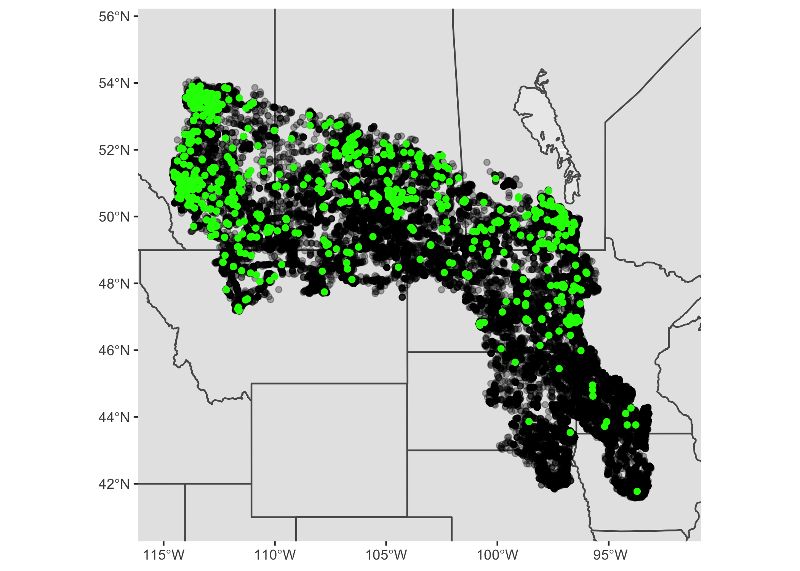

# Nesting Preferences of Merlins

Presentation ID:

Hiba Chaudhry & Dr. Merkord

Biosciences Department, Minnesota State University Moorhead, 1104 7th
Avenue South, Moorhead, MN 56563 USA

Presented at the MSUM 23rd Online Student Acadmic Conference

Submit a survey for this presentation:
<https://mnstate.co1.qualtrics.com/jfe/form/SV_eFMAwF72JZIoeSq>

## Abstract

The organism that’s understudy is Merlin (*Falco columbarius*), which is
a small, dashing falcon that breeds throughout the northern forests and
prairies of North America, Europe, and Asia. My question is to confirm
if there really is a pattern of more Merlins nesting in urban areas.
This question will be answered with the Species Distribution Model. This
is a quantitative tool used by many ecologists which helps one find a
relationship between a variable and probability of occurrence. EBird
database will be used to obtain data for this project. My variables will
consist of either “present” or “absent” at a given location. Exploratory
data analysis will be used since it permits us to examine the data
without making any assumptions. A prediction that can be made based on
our knowledge on Merlins is that, if an area is too industrialized and
consist of many trees then not many Merlins will be present, since they
require open areas to hunt. A map with predicted abundance, will allow
us to launch other projects regarding Merlins and help us study them
even better because we will have a better understanding of where they
are and which areas they prefer to nest in.

## Introduction

  - Organism of interest is Merlin which is a small species of falcon
    from the Northern Hemisphere

  - The question studied here is “are there are more Merlins nesting in
    urban areas when compared to rural areas”?

  - One hypothesis made was if a particular area consist of innumerable
    trees and buildings then there will not be many Merlins present.
    Merlins require open areas to hunt.

  - To test this hypothesis, a map was created showcasing the abundance
    of Merlins in the region of Canada and United States of America

## Methods

  - This project was created through RStudio.

  - Packages like “mapproj”, “sf”, “rnaturalearth”, “rlang”, “maps”,
    “rnaturalearthdata” were installed which allowed me to come up
    with my final product.

  - The data was obtained from the “Ebird database”, which is what this
    picture displays, the place where I downloaded my files.

## Results

    ## Simple feature collection with 64 features and 83 fields
    ## Geometry type: MULTIPOLYGON
    ## Dimension:     XY
    ## Bounding box:  xmin: -179.1435 ymin: 18.90612 xmax: 179.7809 ymax: 83.11652
    ## CRS:           +proj=longlat +datum=WGS84 +no_defs +ellps=WGS84 +towgs84=0,0,0
    ## First 10 features:
    ##              featurecla scalerank adm1_code diss_me iso_3166_2
    ## 1290 Admin-1 scale rank         2  USA-3514    3514      US-MN
    ## 1291 Admin-1 scale rank         2   CAN-682     682      CA-ON
    ## 1292 Admin-1 scale rank         2  USA-3519    3519      US-WA
    ## 1293 Admin-1 scale rank         2   CAN-633     633      CA-BC
    ## 1294 Admin-1 scale rank         2  USA-3518    3518      US-ID
    ## 1295 Admin-1 scale rank         2  USA-3515    3515      US-MT
    ## 1296 Admin-1 scale rank         2   CAN-632     632      CA-AB
    ## 1297 Admin-1 scale rank         2   CAN-631     631      CA-SK
    ## 1298 Admin-1 scale rank         2  USA-3516    3516      US-ND
    ## 1299 Admin-1 scale rank         2   CAN-630     630      CA-MB
    ##                                            wikipedia iso_a2 adm0_sr
    ## 1290          http://en.wikipedia.org/wiki/Minnesota     US       1
    ## 1291            http://en.wikipedia.org/wiki/Ontario     CA       1
    ## 1292 http://en.wikipedia.org/wiki/Washington_(state)     US       6
    ## 1293   http://en.wikipedia.org/wiki/British_Columbia     CA       3
    ## 1294              http://en.wikipedia.org/wiki/Idaho     US       1
    ## 1295            http://en.wikipedia.org/wiki/Montana     US       1
    ## 1296            http://en.wikipedia.org/wiki/Alberta     CA       1
    ## 1297       http://en.wikipedia.org/wiki/Saskatchewan     CA       1
    ## 1298       http://en.wikipedia.org/wiki/North_Dakota     US       1
    ## 1299           http://en.wikipedia.org/wiki/Manitoba     CA       1
    ##                  name                           name_alt name_local     type
    ## 1290        Minnesota                           MN|Minn.       <NA>    State
    ## 1291          Ontario                       Upper Canada       <NA> Province
    ## 1292       Washington                           WA|Wash.       <NA>    State
    ## 1293 British Columbia Colombie britannique|New Caledonia       <NA> Province
    ## 1294            Idaho                           ID|Idaho       <NA>    State
    ## 1295          Montana                           MT|Mont.       <NA>    State
    ## 1296          Alberta                               <NA>       <NA> Province
    ## 1297     Saskatchewan                               <NA>       <NA> Province
    ## 1298     North Dakota                            ND|N.D.       <NA>    State
    ## 1299         Manitoba                               <NA>       <NA> Province
    ##       type_en code_local code_hasc note hasc_maybe         region region_cod
    ## 1290    State       US27     US.MN <NA>       <NA>        Midwest       <NA>
    ## 1291 Province       <NA>     CA.ON <NA>       <NA> Eastern Canada       <NA>
    ## 1292    State       US53     US.WA <NA>       <NA>           West       <NA>
    ## 1293 Province       <NA>     CA.BC <NA>       <NA> Western Canada       <NA>
    ## 1294    State       US16     US.ID <NA>       <NA>           West       <NA>
    ## 1295    State       US30     US.MT <NA>       <NA>           West       <NA>
    ## 1296 Province       <NA>     CA.AB <NA>       <NA> Western Canada       <NA>
    ## 1297 Province       <NA>     CA.SK <NA>       <NA> Western Canada       <NA>
    ## 1298    State       US38     US.ND <NA>       <NA>        Midwest       <NA>
    ## 1299 Province       <NA>     CA.MB <NA>       <NA> Western Canada       <NA>
    ##      provnum_ne gadm_level check_me datarank abbrev postal area_sqkm sameascity
    ## 1290          0          1       20        1  Minn.     MN         0         NA
    ## 1291          7          1       20        2   Ont.     ON         0         NA
    ## 1292          0          1       20        1  Wash.     WA         0         NA
    ## 1293          2          1       20        2   B.C.     BC         0         NA
    ## 1294          0          1       20        1  Idaho     ID         0         NA
    ## 1295          0          1       20        1  Mont.     MT         0         NA
    ## 1296         12          1       20        2  Alta.     AB         0         NA
    ## 1297         13          1       20        2  Sask.     SK         0         NA
    ## 1298          0          1       20        1   N.D.     ND         0         NA
    ## 1299         11          1       20        2   Man.     MB         0         NA
    ##      labelrank name_len mapcolor9 mapcolor13 fips fips_alt  woe_id
    ## 1290         0        9         1          1 US27     <NA> 2347582
    ## 1291         2        7         2          2 CA08     <NA> 2344922
    ## 1292         0       10         1          1 US53     <NA> 2347606
    ## 1293         2       16         2          2 CA02     <NA> 2344916
    ## 1294         0        5         1          1 US16     <NA> 2347571
    ## 1295         0        7         1          1 US30     <NA> 2347585
    ## 1296         2        7         2          2 CA01     <NA> 2344915
    ## 1297         2       12         2          2 CA11     <NA> 2344925
    ## 1298         0       12         1          1 US38     <NA> 2347593
    ## 1299         2        8         2          2 CA03     <NA> 2344917
    ##                            woe_label         woe_name latitude longitude sov_a3
    ## 1290    Minnesota, US, United States        Minnesota  46.0592  -93.3640    US1
    ## 1291             Ontario, CA, Canada          Ontario  50.5244  -84.7943    CAN
    ## 1292   Washington, US, United States       Washington  47.4865 -120.3610    US1
    ## 1293    British Columbia, CA, Canada British Columbia  54.6943 -124.6620    CAN
    ## 1294        Idaho, US, United States            Idaho  43.7825 -114.1330    US1
    ## 1295      Montana, US, United States          Montana  46.9965 -110.0440    US1
    ## 1296             Alberta, CA, Canada          Alberta  55.2816 -115.0000    CAN
    ## 1297        Saskatchewan, CA, Canada     Saskatchewan  54.4965 -105.6820    CAN
    ## 1298 North Dakota, US, United States     North Dakota  47.4675 -100.3020    US1
    ## 1299            Manitoba, CA, Canada         Manitoba  54.8500  -97.3828    CAN
    ##      adm0_a3 adm0_label                    admin                 geonunit gu_a3
    ## 1290     USA          2 United States of America United States of America   USA
    ## 1291     CAN          2                   Canada                   Canada   CAN
    ## 1292     USA          2 United States of America United States of America   USA
    ## 1293     CAN          2                   Canada                   Canada   CAN
    ## 1294     USA          2 United States of America United States of America   USA
    ## 1295     USA          2 United States of America United States of America   USA
    ## 1296     CAN          2                   Canada                   Canada   CAN
    ## 1297     CAN          2                   Canada                   Canada   CAN
    ## 1298     USA          2 United States of America United States of America   USA
    ## 1299     CAN          2                   Canada                   Canada   CAN
    ##        gn_id          gn_name  gns_id                      gns_name gn_level
    ## 1290 5037779        Minnesota      -1                          <NA>        1
    ## 1291 6093943          Ontario -570663          Ontario, Province d'        1
    ## 1292 5815135       Washington      -1                          <NA>        1
    ## 1293 5909050 British Columbia -561661 British Columbia, Province of        1
    ## 1294 5596512            Idaho      -1                          <NA>        1
    ## 1295 5667009          Montana      -1                          <NA>        1
    ## 1296 5883102          Alberta -559990          Alberta, Province d'        1
    ## 1297 6141242     Saskatchewan -573211     Saskatchewan, Province de        1
    ## 1298 5690763     North Dakota      -1                          <NA>        1
    ## 1299 6065171         Manitoba -568643         Manitoba, Province de        1
    ##      gn_region gn_a1_code         region_sub sub_code gns_level gns_lang
    ## 1290      <NA>      US.MN West North Central     <NA>        -1     <NA>
    ## 1291      <NA>      CA.08            Ontario     <NA>         1      fra
    ## 1292      <NA>      US.WA            Pacific     <NA>        -1     <NA>
    ## 1293      <NA>      CA.02   British Columbia     <NA>         1      eng
    ## 1294      <NA>      US.ID           Mountain     <NA>        -1     <NA>
    ## 1295      <NA>      US.MT           Mountain     <NA>        -1     <NA>
    ## 1296      <NA>      CA.01           Prairies     <NA>         1      fra
    ## 1297      <NA>      CA.11           Prairies     <NA>         1      fra
    ## 1298      <NA>      US.ND West North Central     <NA>        -1     <NA>
    ## 1299      <NA>      CA.03           Prairies     <NA>         1      fra
    ##      gns_adm1 gns_region min_label max_label min_zoom wikidataid name_ar
    ## 1290     <NA>       <NA>       3.5       7.5        2      Q1527    <NA>
    ## 1291     CA08       <NA>       3.5       7.5        2      Q1904    <NA>
    ## 1292     <NA>       <NA>       3.5       7.5        2      Q1223    <NA>
    ## 1293     CA02       <NA>       3.5       7.5        2      Q1974    <NA>
    ## 1294     <NA>       <NA>       3.5       7.5        2      Q1221    <NA>
    ## 1295     <NA>       <NA>       3.5       7.5        2      Q1212    <NA>
    ## 1296     CA01       <NA>       3.5       7.5        2      Q1951    <NA>
    ## 1297     CA11       <NA>       3.5       7.5        2      Q1989    <NA>
    ## 1298     <NA>       <NA>       3.5       7.5        2      Q1207    <NA>
    ## 1299     CA03       <NA>       3.5       7.5        2      Q1948    <NA>
    ##      name_bn          name_de          name_en            name_es
    ## 1290    <NA>        Minnesota        Minnesota          Minnesota
    ## 1291    <NA>          Ontario          Ontario            Ontario
    ## 1292    <NA>       Washington       Washington         Washington
    ## 1293    <NA> British Columbia British Columbia Columbia Británica
    ## 1294    <NA>            Idaho            Idaho              Idaho
    ## 1295    <NA>          Montana          Montana            Montana
    ## 1296    <NA>          Alberta          Alberta            Alberta
    ## 1297    <NA>     Saskatchewan     Saskatchewan       Saskatchewan
    ## 1298    <NA>     North Dakota     North Dakota   Dakota del Norte
    ## 1299    <NA>         Manitoba         Manitoba           Manitoba
    ##                   name_fr name_el name_hi       name_hu          name_id
    ## 1290            Minnesota    <NA>    <NA>     Minnesota        Minnesota
    ## 1291              Ontario    <NA>    <NA>       Ontario          Ontario
    ## 1292   État de Washington    <NA>    <NA>    Washington       Washington
    ## 1293 Colombie-Britannique    <NA>    <NA> Brit Columbia British Columbia
    ## 1294                Idaho    <NA>    <NA>         Idaho            Idaho
    ## 1295              Montana    <NA>    <NA>       Montana          Montana
    ## 1296              Alberta    <NA>    <NA>       Alberta          Alberta
    ## 1297         Saskatchewan    <NA>    <NA>  Saskatchewan     Saskatchewan
    ## 1298       Dakota du Nord    <NA>    <NA>  Észak-Dakota     Dakota Utara
    ## 1299             Manitoba    <NA>    <NA>      Manitoba         Manitoba
    ##                  name_it name_ja name_ko        name_nl            name_pl
    ## 1290           Minnesota    <NA>    <NA>      Minnesota          Minnesota
    ## 1291             Ontario    <NA>    <NA>        Ontario            Ontario
    ## 1292          Washington    <NA>    <NA>     Washington         Waszyngton
    ## 1293 Columbia Britannica    <NA>    <NA> Brits-Columbia Kolumbia Brytyjska
    ## 1294               Idaho    <NA>    <NA>          Idaho              Idaho
    ## 1295             Montana    <NA>    <NA>        Montana            Montana
    ## 1296             Alberta    <NA>    <NA>        Alberta            Alberta
    ## 1297        Saskatchewan    <NA>    <NA>   Saskatchewan       Saskatchewan
    ## 1298     Dakota del Nord    <NA>    <NA>   North Dakota    Dakota Pólnocna
    ## 1299            Manitoba    <NA>    <NA>       Manitoba           Manitoba
    ##                 name_pt name_ru          name_sv              name_tr
    ## 1290          Minnesota    <NA>        Minnesota            Minnesota
    ## 1291            Ontário    <NA>          Ontario              Ontario
    ## 1292         Washington    <NA>       Washington            Vasington
    ## 1293 Colúmbia Britânica    <NA> British Columbia Britanya Kolumbiyasi
    ## 1294              Idaho    <NA>            Idaho                Idaho
    ## 1295            Montana    <NA>          Montana              Montana
    ## 1296            Alberta    <NA>          Alberta              Alberta
    ## 1297       Saskatchewan    <NA>     Saskatchewan         Saskatchewan
    ## 1298    Dakota do Norte    <NA>     North Dakota         Kuzey Dakota
    ## 1299           Manitoba    <NA>         Manitoba             Manitoba
    ##               name_vi name_zh      ne_id                       geometry
    ## 1290        Minnesota    <NA> 1159315297 MULTIPOLYGON (((-95.16057 4...
    ## 1291          Ontario    <NA> 1159309687 MULTIPOLYGON (((-89.58175 4...
    ## 1292       Washington    <NA> 1159309547 MULTIPOLYGON (((-122.6533 4...
    ## 1293 British Columbia    <NA> 1159307717 MULTIPOLYGON (((-117.0382 4...
    ## 1294            Idaho    <NA> 1159315339 MULTIPOLYGON (((-117.0382 4...
    ## 1295          Montana    <NA> 1159315333 MULTIPOLYGON (((-116.0482 4...
    ## 1296          Alberta    <NA> 1159308775 MULTIPOLYGON (((-109.9993 4...
    ## 1297     Saskatchewan    <NA> 1159308773 MULTIPOLYGON (((-104.0476 4...
    ## 1298             <NA>    <NA> 1159315337 MULTIPOLYGON (((-104.0476 4...
    ## 1299         Manitoba    <NA> 1159308777 MULTIPOLYGON (((-97.22609 4...

<!-- -->

  - This coding allowed me to create my map, showing Merlin abundance.

  - Black dots are spots where people looked for birds

  - Green dots are the spots where the birds were founded

  - Not only do we want to know where Merlins are but we also must be
    aware of the places they are not present.

  - A “complete checklist” is a checklist with all species documented,
    where species not observed are put in as “absent”. This allows us to
    see where Merlins are not present.

  - The regions where green dots are clumped are cities which are
    comprised of more Conifers when compared to open land which have
    shrubs and grasses and not a lot of conifer trees.

  - A lot of black means there weren’t many Merlins observed, which is
    what is shown in the South area of the map.

## Discussion

  - The green dots are clumped where cities are present. There are more
    Conifers trees in the cities. More small birds take shelter in the
    Conifers. Merlins prey on small birds like Horned Larks, House
    Sparrows, Pigeons.

  - Some of the different hypotheses that I came up with were called
    nest availability hypothesis, food availability hypothesis and
    Merlins avoiding human hypothesis.
    
      - Nest availability hypothesis sates that there will be more nests
        in the cities because there would be more Conifers present.
    
      - Food availability hypothesis present the concept that there will
        be more Merlins observed in cities because there are more
        smaller birds present.
    
      - Merlins avoiding humans hypothesis says that if an area is too
        populated, not many Merlins will be found due to innumerable
        buildings and high noise level.
    
    

  - To test all of these hypotheses, more data is needed. Data about
    people and vegetation. Try to see if there any patterns between
    variables like trees and Merlins and people.

  - Step 1 of the project is completed which was to get a map showing
    Merlin abundance. The map serves as a tool to do more investigation
    on Merlins.
    
      - This will help us launch other projects like studying Merlin
        behavior or fitness studies. Fitness studies would compare the
        fitness of urban Merlins to non-urban Merlins and see how
        different environments impact these birds.

## References

  - RStudio Team (2021). RStudio: Integrated Development Environment for
    R. RStudio, PBC,
    
    Boston, MA URL <http://www.rstudio.com/.>

  - GDAL/OGR contributors (2021). GDAL/OGR Geospatial Data Abstraction
    
    software Library. Open Source Geospatial Foundation. URL
    <https://gdal.org>

  - eBird Basic Dataset. Version: EBD\_relFeb-2021. Cornell Lab of
    Ornithology, Ithaca, New York. Feb 2021. eBird Basic Dataset.
    Version: EBD\_relFeb-2021. Cornell Lab of Ornithology, Ithaca, New
    York. Feb 2021.

  - I used R Version 4.0.5 (R Core Team 2021)

  - Software: R Core Team (2020). R: A language and environment for
    statistical computing. R Foundation for Statistical Computing,
    Vienna, Austria. URL <https://www.R-project.org/>.

Ask him about the code in the results section and that you don’t have
any paras

Ask him if that is what you should talk about in your discussion

Ask him if it would be a good idea to draw that hypothesis diagram

Citations ok? Tips/tricks to do good.
